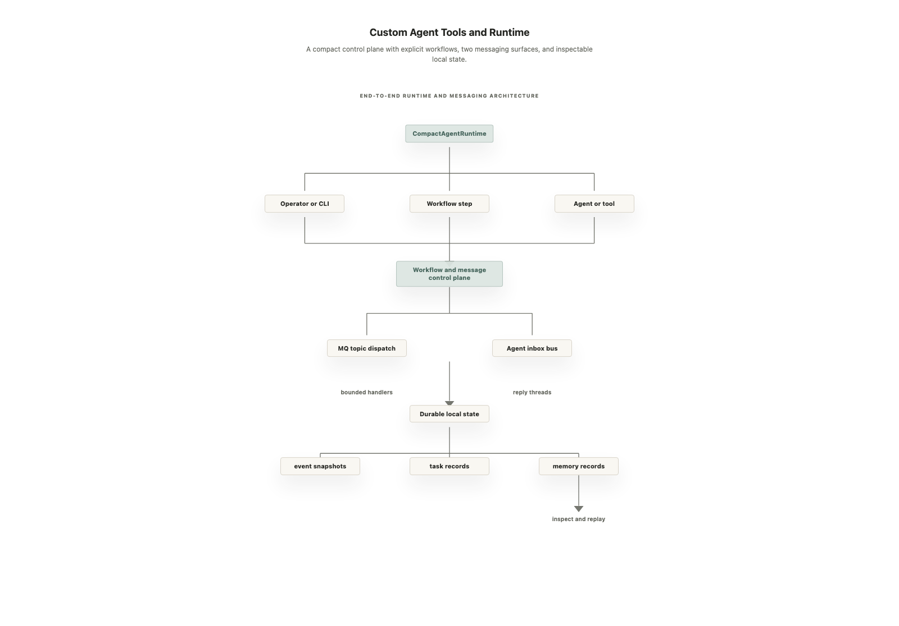

# Custom Agent Tools and Runtime


A compact, inspectable Python toolbox for building local agent systems.

This project brings the essential parts of an agent control plane into one
direct-folder repository: workflow resolution and execution, deterministic
message dispatch, durable agent-to-agent messaging, local memory, browser
inspection, diagram generation, knowledge search, and post-work feedback.

The emphasis is not on hiding everything behind a framework. It is on making
each boundary visible. A reader can follow a request from its entry point,
through a workflow or message handler, into durable state, and back to a result
without needing a separate service map.



The diagram is generated from
[`docs/project-architecture-diagram.yaml`](docs/project-architecture-diagram.yaml)
by the included diagram builder. The portable HTML rendering is available at
[`docs/project-architecture-diagram.html`](docs/project-architecture-diagram.html).

## What This Project Gives You

- A small `CompactAgentRuntime` facade that joins workflows, memory, MQ-style
  dispatch, and durable agent messages.
- A YAML workflow engine with dependency validation, conditions, retries,
  timeouts, cancellation, and bounded parallel groups.
- A FastAPI message queue whose topics map to explicit, deterministic handlers.
- A second messaging layer for named agents, inboxes, replies, lifecycle
  records, tasks, and operational errors.
- A file-backed memory store with deterministic lexical retrieval.
- Standalone tools for browser inspection, architecture diagrams, knowledge
  search, and post-work strategy feedback.
- Plain JSON and JSONL state under `.agent-state/`, so runs remain inspectable
  with ordinary filesystem tools.
- Local smoke tests that avoid live Codex sessions, browsers, or servers unless
  those capabilities are explicitly invoked.

This is a starter runtime and tool library, not a hosted orchestration platform.
It deliberately avoids provider hierarchies, vector databases, schedulers, and
frontend/backend bridge layers until a real use case requires them.

## The 60-Second Mental Model

There are four layers:

1. **Callers** use `runtime.py`, the workflow CLI, the MQ API, or a custom tool.
2. **Orchestration** resolves YAML workflows and turns requests into ordered or
   parallel steps.
3. **Messaging and services** route bounded work to file operations, memory,
   workflow lookup, task storage, or named agents.
4. **Durable state** records what happened under `.agent-state/` as readable
   JSON files.

`runtime.py` is the simplest entry point. It loads the direct-folder modules and
offers one Python API for the most common operations:

```python
from runtime import CompactAgentRuntime

runtime = CompactAgentRuntime(".")

workflow = runtime.resolve_workflow("analysis")
health = runtime.process_message("invoke-function", {"name": "health"})
message_path = runtime.send_agent_message(
    sender="planner",
    recipient="implementer",
    message_type="task.request",
    payload={"task": "Add a health check"},
)
```

## How One Request Moves Through the System

Consider an operator asking the runtime to execute the `analysis` workflow.

1. `CompactAgentRuntime` creates a `RunContext` with a run id, session id,
   workflow id, prompt, and in-memory runtime events.
2. `workflow/engine.py` reads the two workflow YAML files, expands reusable
   step references, validates dependencies, and selects the requested workflow.
3. The workflow runner executes steps in dependency order. When no real handler
   is supplied, unsupported external work is represented as a deterministic
   dry run rather than secretly launching another system.
4. Runtime events describe start and completion state to the caller.
5. If a step sends MQ work, the event is persisted, marked as processing,
   dispatched by topic, given a result, and persisted again as processed or
   failed.
6. Memory, task, message, and error outputs are written beneath the selected
   project root in `.agent-state/`.

That flow is intentionally transparent: YAML explains the plan, Python owns the
execution rules, and files show the resulting state.

## Architecture at a Glance

| Area | Entry point | Responsibility |
| --- | --- | --- |
| Runtime facade | `runtime.py` | One API for workflow, memory, MQ dispatch, agent messaging, and CLI commands. |
| Runtime contracts | `runtime_support.py` | `RunContext`, `RuntimeEvent`, UTC timestamps, and JSON-compatible summaries. |
| Workflow engine | `workflow/engine.py` | YAML loading, ref expansion, dependency checks, conditions, retry/timeout behavior, cancellation, and parallel groups. |
| MQ API | `mq_server/server.py` | FastAPI routes and a background queue worker. |
| MQ dispatcher | `mq_server/handler.py` | Allow-listed topic-to-function routing for deterministic work. |
| MQ storage | `mq_server/store.py` | Event snapshots and task records under `.agent-state/`. |
| Agent messaging | `agent-custom-tools/event-messaging/` | Named inboxes, replies, lifecycle archives, tasks, and errors. |
| Memory | `memory-server/server.py` | JSON record storage, basic secret rejection, and lexical search. |
| Custom tools | `agent-custom-tools/` | Diagram, browser, research, messaging, and feedback utilities. |

## Messaging: Two Surfaces, Two Jobs

The project contains two messaging surfaces because deterministic runtime work
and asynchronous agent coordination have different needs.

### 1. MQ topics: request work from the runtime

`mq_server/` is the runtime work desk. A caller submits an event with a `topic`,
`sender`, and `payload`. The worker persists the event, routes it to an
allow-listed handler, attaches the result, and stores the final state.

```json
{
  "event_id": "evt-health-check",
  "topic": "invoke-function",
  "status": "pending",
  "sender": "operator",
  "payload": {
    "name": "health"
  },
  "timestamp": "2026-09-16T12:00:00Z",
  "result": null
}
```

After handling, the same envelope carries the outcome:

```json
{
  "event_id": "evt-health-check",
  "topic": "invoke-function",
  "status": "processed",
  "sender": "operator",
  "payload": {
    "name": "health"
  },
  "timestamp": "2026-09-16T12:00:00Z",
  "result": {
    "ok": true,
    "project_root": "/path/to/project"
  }
}
```

Supported topics are deliberately explicit:

| Topic | What it does |
| --- | --- |
| `todo` | Writes a task record. |
| `read-file` | Reads a UTF-8 file inside the selected project root. |
| `write-file` | Writes text inside the selected project root. |
| `update-file` | Writes formatted JSON inside the selected project root. |
| `delete-file` | Deletes one file inside the selected project root. |
| `run-workflow` | Resolves a named workflow and returns its expanded steps. |
| `memory-store` / `memory-search` / `memory-health` | Calls the corresponding memory operation. |
| `memory` | Routes `store`, `remember`, `search`, `retrieve`, `query`, or `health` actions. |
| `invoke-function` | Calls a small allow-list of helper functions such as `health`. |
| `system-error` | Converts an operational error into an actionable task record. |

File operations pass through `safe_project_path()`. A path that escapes the
configured project root is rejected before it can be read, written, or deleted.

The HTTP surface is equally small:

| Method | Route | Purpose |
| --- | --- | --- |
| `POST` | `/messages` | Submit an event for processing. |
| `GET` | `/messages/{event_id}` | Read one event snapshot. |
| `GET` | `/messages` | List known events. |
| `GET` | `/health` | Check server health. |

### 2. Agent messages: coordinate named workers

`agent-custom-tools/event-messaging/` is the durable coordination surface. An
`AgentMessage` contains:

- `id` and `created_at` for identity and ordering;
- `sender` and `recipient` for routing;
- `type` for selecting a registered handler;
- `payload` for task-specific data;
- optional `reply_to` for a visible request/reply thread.

Sending a message writes it to the recipient's inbox and creates a durable
record. `AgentHub` polls inboxes, finds a handler registered for the exact
`(recipient, message type)` pair, and then:

- moves successful work to `processed/` and sends a `.result` reply;
- moves unhandled or failed work to `failed/` with an error sidecar;
- updates the indexed message record and append-only event log;
- preserves `reply_to`, allowing the complete thread to be reconstructed.

The same bus can store task status histories and track the current operational
error. Repeated errors receive a stable fingerprint and occurrence count; fixed
or superseded errors are archived.

Example:

```bash
python agent-custom-tools/event-messaging/main.py \
  --root /tmp/agent-messages \
  send \
  --sender planner \
  --recipient agent-health \
  --type health.request

python agent-custom-tools/event-messaging/main.py \
  --root /tmp/agent-messages \
  hub run-once
```

The resulting state is ordinary files:

```text
.agent-state/
├── agents-messaging/
│   ├── inbox/<agent-id>/
│   ├── processed/<agent-id>/
│   ├── failed/<agent-id>/
│   ├── records/
│   │   ├── events.jsonl
│   │   ├── messages/
│   │   └── tasks/
│   ├── errors/
│   ├── current-error.json
│   └── manifest.json
├── cache/memory/records/
├── messages/events-<topic>/
├── task/<project>/
├── strategy-feedback/
└── playwright-ui-testing/
```

## Workflows

Workflow definitions live in:

- `workflow/yamls/workflow-orchestrator.yaml` — named workflows and their
  ordered step references;
- `workflow/yamls/workflow-steps.yaml` — reusable step definitions.

The supplied workflows cover selection/planning, normal feature work,
analysis, plan-only work, validation, error remediation, and a small Codex
smoke path. Supported step primitives include `agent`, `shell`, `tool`,
`message`, `workflow`, `controller`, `hook`, `parallel`, and
`conditional-parallel`.

Resolve or dry-run a workflow from the root:

```bash
python runtime.py resolve-workflow --workflow analysis
python runtime.py run --workflow analysis --prompt "Inspect the message flow"
```

Or use the workflow-specific CLI:

```bash
python workflow/main.py resolve --workflow analysis
python workflow/main.py run --workflow analysis --prompt "Inspect the runtime"
```

Real integrations can pass handlers to `WorkflowEngine.execute()`. This keeps
the workflow model reusable while leaving external side effects under the
caller's control.

## Custom Tool Catalog

### Diagram builder

`agent-custom-tools/diagram-builder/` converts declarative YAML into portable,
static HTML. It includes flow, tree, event-bus, component-stack, fan-in/fan-out,
square-node, and horizontal-arrow components. The renderer performs strict
component and node-count validation before writing output.

```bash
python agent-custom-tools/diagram-builder/diagram_builder.py \
  docs/project-architecture-diagram.yaml \
  docs/project-architecture-diagram.html \
  --components agent-custom-tools/diagram-builder/libs/components.yaml \
  --css-href ../agent-custom-tools/diagram-builder/assets/styles.css
```

### Playwright UI testing

`agent-custom-tools/playwright-ui-testing/` provides persistent Chromium
session management, screenshot capture, short network traces, browser console
errors, and basic DOM hydration checks. Playwright imports lazily, so the rest
of the library can be tested without installed browser binaries.

### Knowledge search

`agent-custom-tools/knowledge-search/` separates structured web search,
multi-question research bundles, and local log/error search. Each capability
has a small module and is exposed through a dispatcher CLI.

### Strategy feedback

`agent-custom-tools/strategy-feedback/` collects post-work feedback from a JSON
fixture or a Tkinter form, parses analyzer output, falls back to deterministic
local analysis when needed, and emits memory-source metadata.

## Repository Map

```text
.
├── README.md
├── ARCHITECTURE.md
├── code-map.yaml
├── project.toml
├── requirements.txt
├── runtime.py
├── runtime_support.py
├── workflow/
│   ├── engine.py
│   ├── main.py
│   └── yamls/
├── mq_server/
│   ├── server.py
│   ├── handler.py
│   └── store.py
├── memory-server/
│   └── server.py
├── agent-custom-tools/
│   ├── diagram-builder/
│   ├── event-messaging/
│   ├── knowledge-search/
│   ├── playwright-ui-testing/
│   └── strategy-feedback/
├── articles/
│   ├── component-catalog-and-orchestration.*
│   ├── intuitive-agent-messaging-flow.*
│   └── memory-shaped-clean-diagram-building.*
└── docs/
    ├── project-architecture-diagram.yaml
    ├── project-architecture-diagram.html
    └── project-architecture-diagram.png
```

`ARCHITECTURE.md` explains module boundaries in more detail, while
`code-map.yaml` maps concrete files to their responsibilities and key symbols.

## Setup

Python 3.11 or newer is required.

```bash
python3 -m venv .venv
source .venv/bin/activate
python -m pip install -r requirements.txt
```

Start the MQ API from the repository root:

```bash
uvicorn mq_server.server:app --host 127.0.0.1 --port 8010
```

The browser tool additionally needs a Playwright browser installation when live
browser operations are used:

```bash
playwright install chromium
```

## Validation

Run the root integration smoke test:

```bash
python test.py
```

Run every focused smoke test:

```bash
python workflow/test.py
python mq_server/test.py
python memory-server/test.py
python agent-custom-tools/event-messaging/test.py
python agent-custom-tools/diagram-builder/test.py
python agent-custom-tools/knowledge-search/test.py
python agent-custom-tools/playwright-ui-testing/test.py
python agent-custom-tools/strategy-feedback/test.py
```

Compile all Python sources:

```bash
python -m compileall runtime.py runtime_support.py workflow mq_server \
  memory-server agent-custom-tools
```

The tests use temporary directories and local fakes where practical. They do
not require a live Codex session, a running FastAPI server, or a browser merely
to validate the core contracts.

## Operating Boundaries

- Runtime state belongs in `.agent-state/` and is ignored by Git.
- File topics may operate only inside the selected project root.
- MQ topics and agent handlers are allow-listed; an unknown route fails
  explicitly.
- Memory rejects obvious secret assignments in required text fields.
- Web search and live browser inspection are optional, external capabilities.
- Workflow dry runs demonstrate orchestration but do not turn this library into
  a full remote agent executor.
- The generated HTML diagrams are static and use relative local assets.

## Using It as a Codex Plugin

The library can be wrapped as a thin Codex plugin when these tools need to move
between workspaces. The plugin should point agents at the existing runtime and
tool folders instead of copying their behavior into a second framework.

See [`PLUGIN_SCAFFOLDING.md`](PLUGIN_SCAFFOLDING.md) for the recommended plugin
layout, manifest guidance, skill instructions, and validation checklist.

## More Detailed Walkthroughs

- [Agent messaging flow](articles/intuitive-agent-messaging-flow.md)
- [Generated messaging diagrams](articles/intuitive-agent-messaging-flow-diagrams.html)
- [Component catalog and orchestration](articles/component-catalog-and-orchestration.md)
- [Memory-shaped diagram building](articles/memory-shaped-clean-diagram-building.md)
- [Architecture reference](ARCHITECTURE.md)
- [Code map](code-map.yaml)

The HTML article pages include lightweight page-view logging through
`articles/runtime-config.js` and `articles/page-view-logging.js`. GitHub README
views use the 1x1 image request at the top of this file; GitHub image proxying
and caching mean it should be treated as an approximate view signal, not exact
per-reader analytics.
